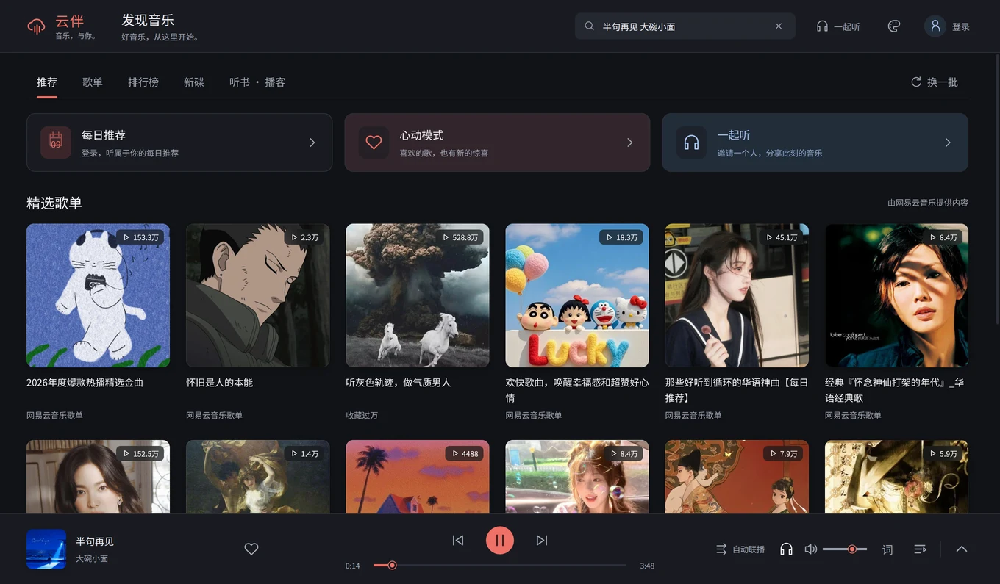

  
  <h1>云伴 · CloudTogether</h1>
  
音乐，有人作伴。

  
连接网易云音乐的 Linux 桌面客户端。

  
<a href="https://z-q-chen.github.io/cloudtogether/">产品官网</a> · <a href="https://github.com/z-q-chen/CloudTogether/releases/tag/v0.1.0">下载</a> · <a href="https://z-q-chen.github.io/articles/cloudtogether-010/">设计手记</a>

## 在桌面，继续听

- **发现音乐**：推荐、分类歌单、排行榜、新碟、听书与播客。
- **我的音乐**：连接网易云账号，查看创建与收藏的歌单、喜欢的音乐。
- **一起听**：共同队列、双人头像，以及云端记录的累计时长。
- **桌面歌词**：独立置顶的小窗，支持拖动、缩放与字号调整。
- **随心播放**：底部播放栏与完整播放页，自动联播、单曲循环、随机与心动推荐。
- **换一种颜色**：六款皮肤，思源黑体与思源宋体。

## 下载

适用于 **Ubuntu / Linux x86_64**。

1. 下载 [Linux 压缩包](https://github.com/z-q-chen/CloudTogether/releases/download/v0.1.0/CloudTogether-0.1.0-linux-x64-compact.tar.gz) 并解压。
2. 运行「启动云伴.sh」。
3. 如需桌面入口，运行「安装到应用菜单.sh」。

点击右上角头像登录；底栏的上箭头展开播放页，「词」开关桌面歌词。

一起听为试用功能，手机端兼容性仍待确认；会员音源和账号写入的支持仍需完善。

## 参与

[反馈问题](https://github.com/z-q-chen/CloudTogether/issues) · [开发说明](docs/development.md) · [架构](docs/architecture.md)

感谢 [NeteaseCloudMusicApiEnhanced](https://github.com/NeteaseCloudMusicApiEnhanced/api-enhanced) 及开源贡献者。云伴是第三方客户端。项目采用 [MIT](LICENSE)，第三方许可见 [THIRD_PARTY_NOTICES.md](THIRD_PARTY_NOTICES.md)。
